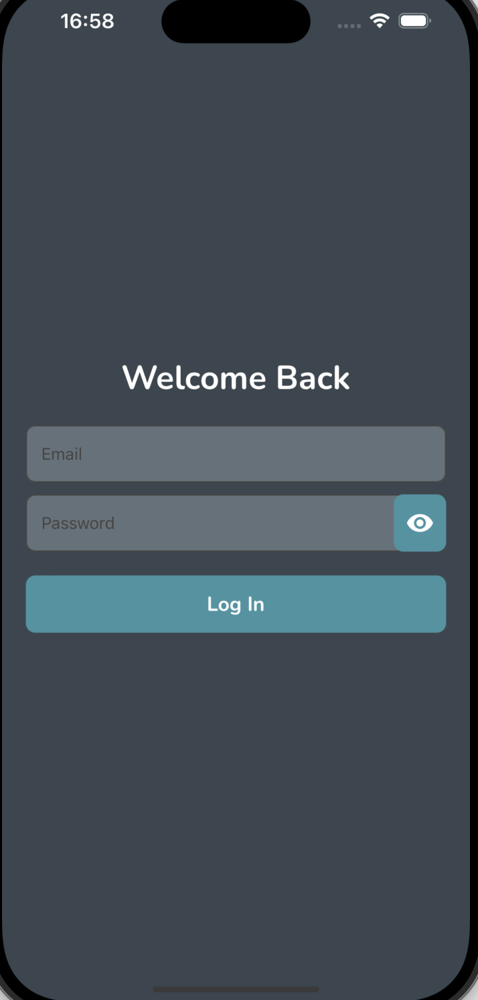
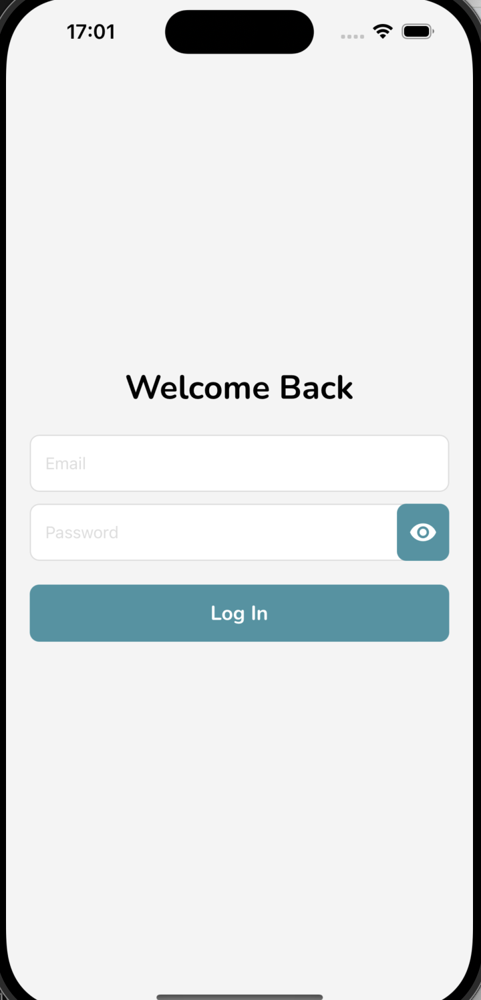
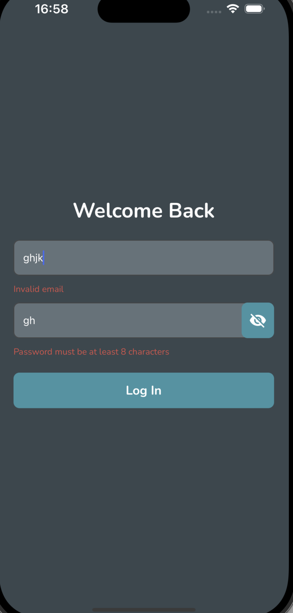
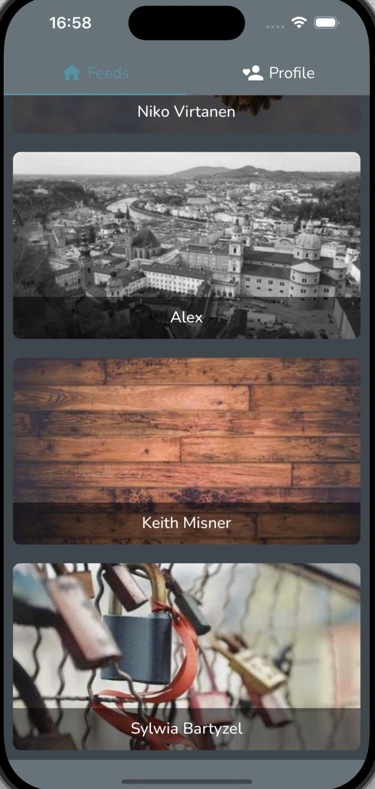
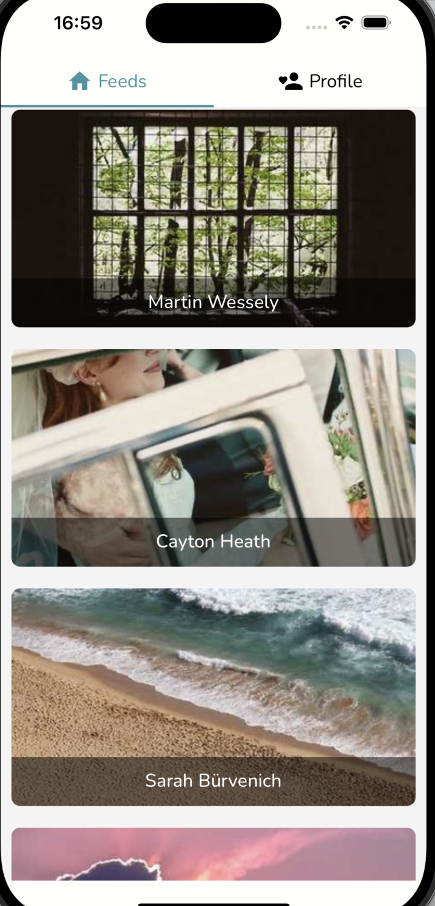
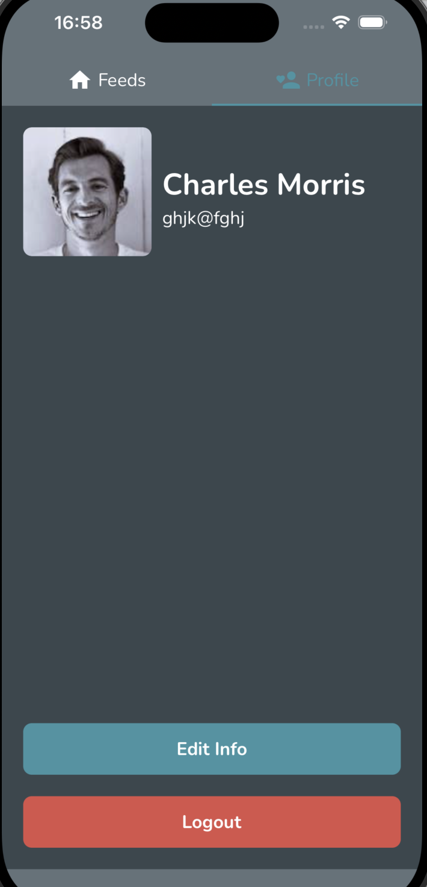
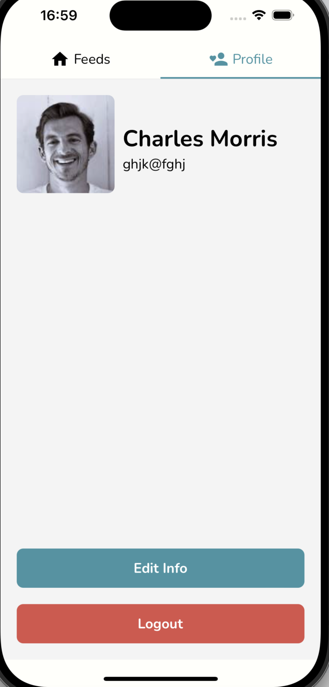
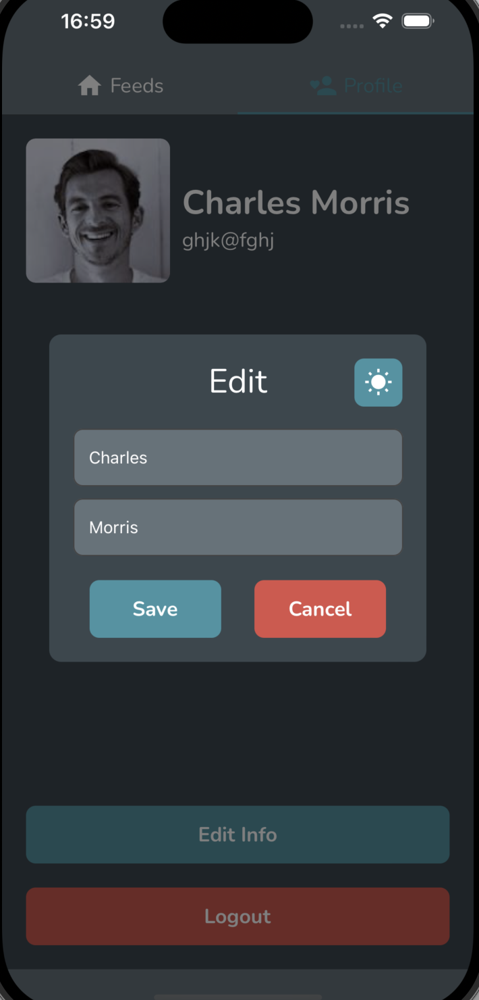
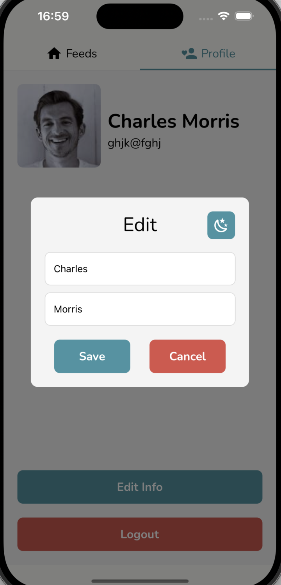

# Demo Application

Demo Application is a mobile app that showcases essential features, including user authentication, a dynamic content feed, and personalized profile management. Users can log in to access a curated feed of updates and easily manage their profiles, including editing personal information. This app offers an interactive and streamlined user experience.

## Features

The app includes:

- **User Authentication:** Secure login and registration process for users.
- **Profile Management:** Users can view and edit their profiles
- **Data Fetching:** Integrates with APIs to fetch and display data in real-time.
- **Pull-to-Refresh:** Pull down Feeds to get a new images at any time.

## Screenshots

### Login Screens

  

    
    
Login Dark Screen

  

  

    
    
Login Light Screen

  

  

    
    
Login Wrong

  

### Feeds Screens

  

    
    
Feeds Dark Screen

  

  

    
    
Feeds Light Screen

  

### Profile Screens

  

    
    
Profile Dark Screen

  

  

    
    
Profile Light Screen

  

### Edit Screens

  

    
    
Edit Dark Screen

  

  

    
    
Edit Light Screen

  

## Tech Stack

This app is built using the following technologies:

- **React Native:** For building cross-platform mobile apps.
- **Redux Toolkit:** For managing global state, including character data, guesses, and app settings.
- **TypeScript:** For type-safe JavaScript.
- **React Navigation:** For navigating between screens (Bottom Tabs).
